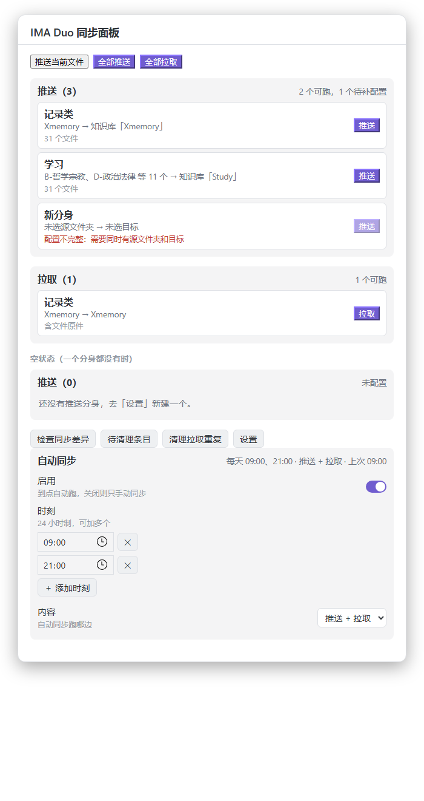

# IMA Duo Sync（ima-duo）

Obsidian ↔ IMA 双向同步插件（桌面端专用）。把 Obsidian 里的文件/文件夹**推送**到 IMA 知识库或个人笔记，也能把 IMA **个人笔记与知识库**拉取到 vault。

> 改名说明：原想叫 `ima-sync`，但容易和社区里的 `ima-copilot-sync` 搞混，故定名 `ima-duo`（duo = 双向）。

## 能力边界

| 方向 | 知识库 | 个人笔记 |
| --- | --- | --- |
| 推送（Obsidian → IMA） | ✅ 支持（自动建子文件夹；md→笔记，文件→COS 上传） | ✅ 支持（md→笔记，可归入笔记本） |
| 拉取（IMA → Obsidian） | ✅ 支持（笔记型取 markdown 正文；**各类文件型（pdf/epub/docx/pptx/xlsx/图片/音频…）都能下载原件**；网页/链接类写占位 md） | ✅ 支持（list_note + export_note 下载全文） |

**平台限制**：IMA 写接口**无覆盖更新、无删除**。所以"改文件"没法在原地改——插件的做法是：**未改动的不重推，改动过的带版本号另存一份**（`笔记.md` → `笔记@v2.md`），旧版留在库里，要清就请在 IMA 客户端手动删。删除同理，两个方向都不会自动同步删除。

**文件链接有时效**：知识库中文件型条目下载走的是带签名的临时链接，约 8 小时后失效——所以拉取文件请一次性拉完，别把链接存下来慢慢下。

## 隐私与网络

- **联网范围**：只在同步时连接 IMA 官方接口 `https://ima.qq.com`，以及文件上传 / 下载用的腾讯云 COS 域名（`*.myqcloud.com`）。除此之外不发起任何请求。
- **凭证去向**：Client ID / API Key 只作为请求头发往 `ima.qq.com`，不会发往其它任何地方。文件上传用的是 IMA 下发的临时 COS 凭证，你的 API Key 不会交给 COS。
- **读取 vault 外的文件**：仅当你打开「从本地文件读取凭证」时，才会读取本机的 `~/.config/ima/client_id` 与 `api_key`。这是该开关存在的唯一目的，关掉后不读。
- **不含遥测**：没有任何埋点、统计或上报。调试日志只写本机文件 `ima-debug.log`，默认关闭。
- 本插件是第三方作品，与腾讯 / IMA 官方没有隶属或背书关系。

## 推送 / 拉取「分身」

推送与拉取都做成了**命名分身**，可以并存多套配置，互不干扰。

| | 一个分身 = | 多分身用来干什么 |
| --- | --- | --- |
| **推送分身** | 一组源文件夹 → 一组目标 | 同一个源分别推到不同知识库，且能各自单独重推（例：分身甲把文件夹 `A` 推到知识库甲，分身乙把同一个 `A` 推到知识库乙） |
| **拉取分身** | 一组知识库（可选含个人笔记）→ 一个落地目录 | 不同知识库进不同本地目录（例：知识库甲 → `本地/甲`，知识库乙 → `本地/乙`） |

**推送分身的组合规则**：分身的多个源文件夹取**并集**，作为一次推送的内容；**每个目标都会收到全部源的内容**，每个文件相对**它自己所属的那个源**算路径（源文件夹这一层带不带，由该分身的「保留源文件夹本身这一层」开关决定，见下节）。每个目标**各自独立查重**。知识库甲里有同名条目，不影响知识库乙的推送。

举例：分身里选源 `A`、`B`，目标是知识库甲、知识库乙，则 A 与 B 里的所有文件都会分别进两个库，共推 2 遍。

设置页里每个分身是一张可折叠卡片：改名字、选源文件夹（多选、带搜索）、开合「保留源文件夹本身这一层」、添加目标（可多选知识库，也可加个人笔记）、给每个知识库目标单独指定知识库里的小文件夹（「改落点」）、单独跑或删掉。底部另有 **「全部推送」/「全部拉取」** 依次跑完所有分身，单个分身出错不打断后面的。

升级自旧版时会**自动迁移**：原来的单项配置会变成名为「默认推送」「默认拉取」的分身，旧的分项设置项随即从设置页移除，不会出现两套配置。

## 文件夹语义：以整棵树推送，源文件夹这一层可开关

推送时**默认保留源文件夹本身这一层**——每个源文件夹在目标端建成一个以自己名字命名的顶层文件夹，里面的子文件夹原样保留：

```
本地                     知识库
读书/                    读书/
├── 小说/a.md            ├── 小说/a.md
├── 散文/b.md            ├── 散文/b.md
└── top.md               └── top.md
```

把某个分身的「保留源文件夹本身这一层」关掉，就只推里面的内容，`小说`、`散文` 直接摊在落点下，不建 `读书` 这一层。

**同名不重复嵌套**：源文件夹名与「落点名」相同时自动丢掉这一层。落点名指 —— 指定了知识库内文件夹就用那个文件夹名，没指定就用**知识库名**。所以：

- 源文件夹 `读书` → 知识库 `读书`（落点根）→ 内容直接进库根（`小说/`、`散文/`），**不会**出现 `读书/读书`
- 源文件夹 `读书` → 落点选知识库里的 `读书` → 同样只并进去一层
- 源文件夹 `读书` → 知识库 `我的资料`（名字不同）→ 照常建出 `读书`

其余情况下，目标端已有同名文件夹时一律**复用合并**，不会重建。

**多源**：每个源都成为一棵独立的顶层树，`A` 与 `B` → 目标端 `A/` 与 `B/` 并列。若同时选了父子两层（`A` 与 `A/B`），文件归到**更具体**的那个源、只推一份，两棵树各建各的顶层，父树里不会重复包含子树。

**落点**：目标 chip 的「改落点」可以指定知识库里的位置。落点文件夹与源文件夹同名时，自动丢掉这一层（守卫生效）。

**拉取**：知识库的树原样镜像到本地，知识库自己的顶层文件夹保留。拉到目录 `本地/读书`，得到 `本地/读书/小说/…`。一个分身在拉多个知识库到同一目录时，打开该分身的「知识库名称作为子文件夹」，每个库各自建一层同名文件夹避免混在一起。

拉取按**镜像**语义落盘，重复拉取不会堆副本：目标文件不存在就新建，已存在且**内容一致就跳过**（不写盘、不刷 mtime），内容不同才**覆盖**（路径不变）。完成提示会分开报数：`新建 3，更新 1，未变化跳过 20`。

## 推送的改动语义：只推改动，改动带版本号另存

理想中"改了文件再推，IMA 里那条就跟着变"是做不到的——**IMA 的写接口只有新建，没有覆盖更新，也没有删除**。所以插件把语义定成"能自动化的部分全自动，做不到的部分不假装能做到"：

| 本地文件的状态 | 推送时会发生什么 |
| --- | --- |
| **没改过** | **什么都不做**。连查重请求都不发（先用 size+mtime 快速比对，对不上才读内容算指纹） |
| **改过了** | 带版本号新建一份：`报告.md` → `报告@v2.md`，`书.pdf` → `书@v2.pdf`（版本号插在扩展名之前）。再改就是 `@v3`、`@v4`……本地记录跟着走，不会重复推同一版 |
| **新增** | 正常推 |
| **插件第一次见到、目标里已有同名** | **采纳**为同一版本（只登记指纹，不新建）。这条是给"升级前已经推过"和"你在 IMA 里手动传过同名文件"兜底的，避免升级后一跑就复制一堆 |
| **在本地删掉** | IMA 那边不动（无删除接口）。反之亦然——**删除是两个方向都不会同步的** |
| 在 IMA 手动删掉旧版后再推 | 该文件若没改动就不会重推；想让改动落地，改一下文件内容再推 |

推送记录（`pushState`）存在插件数据里，键是 `分身id|目标|文件路径`，**同一个文件推到两个知识库各记一份**、互不干扰。设置页有 **「改动怎么处理」→ 清空推送记录** 用于重来一次。

## 两侧对不上怎么办：同步差异检查

「多出来的东西」有两个相反的方向，得分开看：

- **本地有、IMA 没有** —— 忘了推；或者推过之后在 IMA 里被删了
- **IMA 有、本地没有** —— 本地删了/改了名；或者在 IMA 客户端自己传的

再加上前面那套"改动带版本号另存"，库里就会同时躺着**当前版**和一堆**旧版**。

设置页 **「同步差异检查」→ 开始检查**（命令面板 `检查同步差异（本地 ↔ 知识库，生成清单）`）会**联网**读知识库现有条目、与本地源逐条对照，写出 `ima-duo-同步差异.md`：

| 分类 | 含义 | 该做什么 |
| --- | --- | --- |
| ① 本地有、IMA 没有 | 没推过；推过但 IMA 侧已消失的会单独标注 | push |
| ② IMA 有、本地没有 | IMA 多出来的 / 本地删了或改名了 | 还想要 → pull；确实不要 → 去 IMA 删 |
| ③ 两边都有、本地改过 | 内容变了但还没推 | push（库里会新增一份 `@vN`） |
| ④ IMA 里的旧版本残留 | 本地文件还在，但这条不是当前版 | 去 IMA 删，删了不影响同步 |
| ⑤ 同一位置多条同名 | 重复上传 / 手动传重了 | 留一份、删其余 |
| 已同步 | 两边都有且内容一致 | — |

判定用**两个判据**，缺一不可：**位置**（文件夹 + 标题，并照顾 IMA 的两种标题走样 —— 前导 `#`、超长标题被截成「前 30 字…」）判断"这一条在不在对面"；**推送记录里的内容指纹**判断"本地改没改" —— 只看标题永远看不出内容已经换过了。

**纯读扫描**：不推不拉、不写知识库、不改推送记录。条目多时要读整个知识库目录，会慢一点。

### 拉取不会再把旧版本拉成"本地重复文件"

推送产生的 `名字@v2.pdf` 这类条目，pull 时要是不加分辨地照单全收，本地就会多出一份同内容的重复文件 —— 看起来正是"我明明没动它，怎么本地多了一个"。

所以 **pull 默认跳过 `@vN` 条目**（设置页「拉取时跳过历史版本（@vN）」可关）。跳过多少条会在拉取完成的提示里报出来。

## 越用越脏怎么办：待清理条目清单

上面那套"改动带版本号另存 + 删除不同步"跑久了，库里一定会攒下两类**已经没用、但插件删不掉**的条目：

| | 是什么 | 该怎么办 |
| --- | --- | --- |
| **旧版本** | 文件改过 N 次，库里就留下 `名字`、`名字@v2`…`名字@v(N-1)` | 删掉，只留清单里标「保留」的那一版。删了不影响同步 |
| **本地已删除 / 改名** | 本地这个文件没了（删了或改名了），IMA 那边还在原处 | 只在确实不要时才删 |

设置页 **「待清理条目」→ 生成清单**（命令面板 `列出待清理条目（旧版本 / 本地已删除）`）会写出 `ima-duo-待清理条目.md`，每条给出**标题 + 知识库 + 落地文件夹 + 本地对应路径**，旧版本还会写清该保留哪一版。**这份清单不联网**，直接从本地推送记录算出来 —— 所以它只知道"插件推过的东西"；推送记录被清空过就可能列不全。

> IMA 开放接口没有删除能力，清单只是导航，删还得去 IMA 客户端手动删。

另外，每次推送后如果库里还有这类条目，日志会顺手记一行提示（不弹窗打扰）。

已经产生的重复条目（同名同内容），用设置的 **「检查重复条目」→ 扫描**（或命令面板 `检查知识库重复条目`）生成 `ima-duo-重复条目清单.md`，清单按标题分组、列出每条所在文件夹与 `media_id`。

## 清理拉取重复

早期版本拉取时对同名文件会自动加序号（`笔记.md` 已存在就写 `笔记-2.md`），重复拉几次就堆一批副本。该行为已改为上面的镜像语义，**旧副本**用设置的 **「清理拉取重复」→ 扫描**（或命令面板 `清理拉取重复文件`）清掉：

- 只扫描两个拉取目录（笔记目录 + 知识库目录），且只认形如 `名字-2.md` 的文件
- **只有内容与主文件完全一致的**才列入删除；内容不同的会单独列出并保留，交给你判断
- 删除走 `vault.trash(file, true)` —— 进系统回收站，可还原
- 日期文件名（如 `2026-08-10.md`，会被误看成 `2026-08.md` 的副本）已显式排除

## 安装 / 启用

1. 把本插件目录放到 vault 的 `.obsidian/plugins/ima-duo/`。
2. 把 `"ima-duo"` 加入 `.obsidian/community-plugins.json` 的字符串数组。
3. 重启 Obsidian，在「设置 → 社区插件」里启用 **IMA Duo Sync**。
4. 打开插件设置，填凭证（见下），点「测试连接」验证。

> 桌面端专用（`isDesktopOnly: true`），依赖 Node 的 `fs/https/os`，移动端不可用。

## 凭证配置

三种途径，任选其一：

- **粘贴解析**：在 <https://ima.qq.com/agent-interface> 复制凭证文本，回到设置页点「粘贴并解析凭证」，自动识别 `API Key: xxx` / `Client ID: xxx`。
- **手动填写**：分别填 Client ID 与 API Key。
- **从本地文件读取**：开启后直接读 `~/.config/ima/client_id` 与 `api_key`，忽略上方手填值。

凭证存放在 **Obsidian 钥匙串**（`app.secretStorage`）中，不以明文写入 `data.json`。
首次启用时会自动从以下位置迁移一次，避免重复粘贴：本插件钥匙串 → `ima.copilot Sync` 钥匙串 → `data.json` 旧明文 → `~/.config/ima/`。
若 Obsidian 版本低于 1.11.4 不支持钥匙串，则回退为明文存储并在设置页给出提示。

## 设置项

| 分组 | 项 | 说明 |
| --- | --- | --- |
| 同步设置 | 如何获取凭证 / Client ID / API Key / 测试连接 | 凭证与连通性校验（15s 超时） |
| 同步设置 | 从本地文件读取凭证 | 读 `~/.config/ima/` 下的 client_id 与 api_key |
| 同步设置 | 文件名作为笔记标题 | 见下节 |
| 自动同步 | 启用 / 同步时刻（24 小时制，可加多个）/ 同步内容 / 立即同步一次 | 每天到点自动跑「全部推送 / 全部拉取」；可关闭，见下节 |
| 推送 | 推送分身 | 新建 / 每个分身一张卡片：名称、源文件夹（多选）、**保留源文件夹本身这一层**、目标（多选）、改落点、推送这个分身、删除这个分身 |
| 推送 | 全部推送 | 依次跑完所有推送分身（先弹确认框列出每个分身推什么、推给谁） |
| 推送 | 同名条目 | 只在**没有推送记录**（升级前推过/手动传过）且目标已有同名时生效：**跳过（默认，并按同一版本登记）** / 改名新建一份 |
| 推送 | 改动怎么处理 | 说明改动后会带 `@vN` 另存；附 **清空推送记录** 按钮（重来一次对齐） |
| 推送 | 检查重复条目 | 选一个知识库，按**正文指纹**判定真重复，生成 `ima-duo-重复条目清单.md` |
| 推送 | 待清理条目 | 按本地推送记录列出旧版本（`名字@v2` 这类）与本地已删除/改名的条目，生成 `ima-duo-待清理条目.md`（不联网） |
| 推送 | 同步差异检查 | **联网**读知识库条目与本地源对照，生成 `ima-duo-同步差异.md`（本地有/IMA 有/本地改过/旧版本/重复五类，纯读） |
| 推送 | 推送当前文件 | 单独推当前笔记，每次先问目标（一次性操作，不动分身配置） |
| 拉取 | 拉取分身 | 新建 / 每个分身一张卡片：名称、知识库多选、包含个人笔记、落地目录、下载知识库文件、知识库名称作为子文件夹、拉取这个分身、删除这个分身 |
| 拉取 | 拉取时跳过历史版本（@vN） | 默认开：推送残留的 `名字@v2` 不拉回本地，免得堆出同内容的重复文件 |
| 拉取 | 全部拉取 | 依次跑完所有拉取分身 |
| 拉取 | 强制阅读模式 | 拉取下来的文件默认以阅读视图打开，防误编辑 |
| 拉取 | 清理拉取重复 | 扫描各拉取落地目录里旧版堆出来的 `名字-2.md`，只删与主文件内容一致的（进回收站） |
| 通用 | 输出调试日志 | 写 `ima-debug.log`，附路径复制按钮 |

> 分身卡片里的按钮都是「配置」性质，**点了不会直接推送/拉取**；只有卡片底部的「推送这个分身」「拉取这个分身」和「全部推送 / 全部拉取」才会真正执行。

## 自动同步

不想每次都手动点「全部推送 / 全部拉取」时，打开**自动同步**：插件在你设的**每天固定时刻**自动依次跑一遍。

| 设置 | 说明 |
| --- | --- |
| 启用 | 总开关。关闭时**不挂任何定时器**，行为与以前完全一致 |
| 同步时刻（24 小时制） | 一天可以设**多个**时刻，像闹钟一样：点「＋ 添加时刻」加一个，点行尾的 ✕ 删掉。改动后**立即**重排定时器，不用重启 Obsidian |
| 同步内容 | `推送 + 拉取`（默认，最省心）/ `仅推送` / `仅拉取` |
| 立即同步一次 | 不等下一个时刻，马上按当前设置跑一轮（不影响排期） |

- **入口有两处**：设置页「自动同步」小节，以及**侧边栏同步面板底部的同名小设置条** —— 不用专门跑一趟设置页。
- **一天想跑几次就加几个时刻**：例如 `09:00`、`12:30`、`21:00`。时刻表自动去重并按时序排列；全部删空则不再自动跑（状态栏会显示「未设时刻」）。
- **错过就补一次**：到点时 Obsidian 没开着，就在下次启动后约 20 秒补跑一轮 —— **只补一次**，不是把错过的每个时刻各跑一遍。
- **三条守卫**：上一轮没跑完、或你正在手动推 / 拉 → 本轮跳过；没有任何可跑的分身 → 跳过（只有手动触发时才提示"没有可运行的同步分身"）。
- **安静运行**：自动同步期间**不弹**「推送完成 / 拉取完成」通知（否则一天多次刷屏），进度看左下角状态栏；只有出错才弹通知。
- 默认**关闭**；新装时默认给一个 `09:00`。

## 同步面板（侧边栏图标）

点左侧边栏的 **⟳** 图标（或命令面板 `打开同步面板（推送 / 拉取列表）`）打开主界面：

```
┌ IMA Duo 同步面板 ─────────────────────────────┐
│ [推送当前文件] [全部推送] [全部拉取]              │
│                                               │
│ 推送（3）                    2 个可跑，1 个待补配置 │
│  ┌─────────────────────────────────────────┐  │
│  │ 学习                                     │  │
│  │ 读书、散文 等 11 个 → 知识库「我的资料」        │  │
│  │ 523 个文件                        [推送]  │  │
│  ├─────────────────────────────────────────┤  │
│  │ 新分身                                   │  │
│  │ 未选源文件夹 → 未选目标          [推送]置灰 │  │
│  │ 配置不完整：需要同时有源文件夹和目标         │  │
│  └─────────────────────────────────────────┘  │
│                                               │
│ 拉取（1）                          1 个可跑     │
│  ┌─────────────────────────────────────────┐  │
│  │ 记录类                                   │  │
│  │ 读书 → 本地/读书                 [拉取]   │  │
│  └─────────────────────────────────────────┘  │
│                                               │
│ [检查同步差异] [待清理条目] [清理拉取重复] [设置] │
│                                               │
│ 自动同步  每天 09:00、21:00 · 上次 09:00      │
│ 启用  [开]                                    │
│ 时刻  [09:00] ✕   [21:00] ✕   [＋ 添加时刻]   │
│ 内容  [推送 + 拉取 ▾]                         │
└───────────────────────────────────────────────┘
```



- 每行就是**一个分身**：名字、`源 → 目标`、文件数（拉取行是落地目录与选项），右边一个按钮直接跑。
- **没配齐的分身**按钮置灰，下面用红字写明缺什么；栏目标题右侧统计「几个可跑、几个待补配置」。
- **跑的时候面板不关**，按钮变「推送中…」/「拉取中…」，跑完自动重绘；进度看左下角状态栏与右上角通知。
- 行里的源/目标超过 2 项会折叠成「A、B 等 N 个」—— 十几个文件夹全铺出来只会被省略号从中间切断，不如给个能读的摘要。
- 底部四个按钮：差异检查、待清理条目、清理拉取重复、跳到设置页。
- 再往下是**自动同步**小设置条：开关 / 时刻表（24 小时制，可点「＋ 添加时刻」加多个、点 ✕ 删掉）/ 内容，改完立即生效，不用去设置页。（详见上面「自动同步」一节。）

> 之前这个图标是「点一下直接推当前文件」—— 推什么、推到哪全靠弹窗临时选，误触就发出去了。改成面板后，一次点击能看到全部配置，推哪个由你点。

## 命令面板

- `打开同步面板（推送 / 拉取列表）`：等同于点侧边栏图标
- `推当前文件到 IMA（选目标）`
- `推送文件夹到 IMA（选文件夹和目标）`：完整交互，不改动分身配置
- `运行全部推送分身`：先弹确认框
- `运行指定推送分身`：挑一个分身跑
- `拉取个人笔记到 vault`
- `拉取知识库到 vault`
- `运行全部拉取分身`
- `运行指定拉取分身`：挑一个分身跑
- `立即自动同步一次（推送 / 拉取）`：不等下一个时刻，马上按自动同步设置跑一轮
- `检查知识库重复条目（生成清单）`
- `检查同步差异（本地 ↔ 知识库，生成清单）`
- `列出待清理条目（旧版本 / 本地已删除）`
- `清理拉取重复文件`：清掉旧版拉取堆出的 `名字-2.md`

Ribbon 图标（⟳）= 打开同步面板。

## 关于"标题为什么之前没同步上"

IMA 笔记标题由正文**首行**自动派生，`import_doc` 的 `title` 字段不生效。本插件默认开启「文件名作为笔记标题」：推送 md 时把文件名写成正文首个 `# 一级标题`，IMA 就以文件名为标题。

## 实现要点

- **必须用 Obsidian 的 `requestUrl`，不能用 `fetch`。** 渲染进程的 origin 是 `app://obsidian.md`，直接 `fetch` 到 `ima.qq.com` 会被 CORS 拦掉，表现为"填了凭证也连不上"。`requestUrl` 走主进程网络栈，不受同源策略限制。
- **COS 上传的 bucket 字段叫 `bucket_name`，不是 `bucket`。** `create_media` 返回的 `cos_credential` 里，旧版字段 `bucket` 已经没有了，现在是 `bucket_name`（形如 `ima-share-kb-1258344701`，自带 `-appid` 后缀），另外还给了 `appid` / `custom_domain` / `start_time` / `expired_time`。域名要拼成 `${bucket_name}.cos.${region}.myqcloud.com`。读旧字段会拼出 `undefined.cos.ap-shanghai.myqcloud.com`，COS 回 `400 InvalidRequest: Bucket format should be <bucketname>-<appid>`。
  - **这个坑只影响文件型（pdf/epub/docx…）**：笔记走 `import_doc` + `add_knowledge`，完全不经过 COS，所以是一副"笔记都推上去了、文件全被跳过"的假象。
  - 签名有效期优先用服务端下发的 `start_time` / `expired_time`，别用本机 `Date.now()`，避免时钟偏差导致签名过期。
- **拉取文件型条目别只特判 `media_type === 1`。** `get_media_info` 对**所有**文件型条目都会给 `url_info.url`（pdf 1 / doc 3 / ppt 4 / xls 5 / 图片 9 / txt 13 / xmind 14 / 音频 15 / html 20 / epub 21 都一样），所以判断条件应该是「不是笔记(11)、不是文件夹(99) → 走 url_info 下载」。早先只认 1，epub 等会被当作「未知类型」静默丢掉。
  - 落地文件名要**先判重扩展名**：知识库里文件型条目的标题本来就是完整文件名（含扩展名），直接 `${title}${ext}` 会写出 `xxx.pdf.pdf`。扩展名取值顺序：URL 路径 → 标题里已有的 → 按 `media_type` 兜底。
- **查重要认 IMA 那边的"标题走样"。** 本地文件名和库里存下来的标题不一定字面相同，实测两种走样：
  - 正文首行是 `# 标题`、**后面紧跟 YAML frontmatter** 时，标题会保留这个井号（实测存成 `# book-data-combined`）。所以比较前要 `replace(/^#{1,6}\s*/, "")`。
  - **超长标题会被 IMA 截断**成「前 30 字 + `...`」存下来（实测 33 字符），本地文件名却是完整的。只比全等就会把同一条目当成新文件、重复上传一份。所以「以 `...`/`…` 结尾且去掉省略号后 ≥20 字」的标题要额外当**前缀**参与匹配。
  - 不做大小写折叠：库里 `English` 与 `english` 可以并存。
- **"只推改动"靠本地记录，不靠猜。** 记录（`pushState`）键为 `分身id|目标|文件路径`，值为 `{size,mtime,hash,title,version}`。判定顺序：size+mtime 快速排除 → 对不上才读内容算 FNV-1a 指纹 → 指纹相同就只回写探测值（文件被 touch 过而已）→ 真变了才按 `version+1` 推 `名字@vN`。`version` 存在记录里，所以同一版不会被重复推。
  - 没有记录时（升级前推过/手动传过）走**采纳**：目标里已有同名就登记指纹、不新建。这条一旦漏判，升级后第一次推送就会复制一批条目 —— 所以上面的标题归一很关键，真机干跑（`--dry`）就是用来兜这条的。
- **列表类接口要自带退避重试。** `get_knowledge_list` 偶发返回 `code 200001`（无 message，纯频率限制；串行请求通常不会中，短时间连打多个脚本会中）。拉取知识库是「每层文件夹一次请求」，一次限流会让整批中断、只镜像一半 —— `ImaClient.call` 统一退避 0.4/0.8/1.6s（带抖动）重试 3 次，其它错误码立刻冒泡、不重试。
- **"落在哪"只能有一处实现（`computePlacement`）。** 推送和同步差异检查都调它。要是各算一遍，报告说"该落在 `A/B`"、实际却推进了 `A/C`，这种偏差根本没机会被发现 —— 而它恰恰是最难靠肉眼发现的一类问题。
- **`@vN` 是插件的专属记号，拉取时要跳过。** 它由"改动只能另存"产生，真正的当前版另有条目；不加分辨地拉下来，本地就会多出一份同内容的重复文件（表现为"我明明没动它，怎么本地多了一个"）。识别用 `parseVersionedTitle`，先试带扩展名的形式（`a@v2.pdf`），再试不带扩展名的（`笔记@v2`），免得把文件名整个当成原始名。
- 富文本描述用 `createFragment`（Obsidian 全局函数），并保留 `document.createDocumentFragment()` 兜底。
- 设置页类必须 `extends PluginSettingTab` 且 `super(app, plugin)`；否则 Obsidian 1.13+ 的 `addSettingTab()` → `update()` 会在读 `this.app.setting.refreshSearch` 时崩溃。
- esbuild 必须 `external` 掉内置模块与 `obsidian`，`platform` 留默认；`npm run build` 要带 `production` 参数，否则进 watch 不退。

## 回归测试

开发时用 Node 侧的桩测试回归：以尽可能忠实的 Obsidian 运行时桩加载构建产物，共 318 项，覆盖：

- 设置页渲染、`update()` 回归、`createFragment` 缺失兜底
- 凭证迁移三条来源、粘贴解析成功/失败分支
- **旧配置迁移**：单份推送/拉取配置 → 分身；保留源文件夹/目标/目录/开关；迁移后旧字段清空；二次 `onload` 不重复迁移；个人笔记开关独立成分身
- **分身配置**：新建分身默认空配置、文件夹多选弹窗、知识库多选、改落点写回 `kbFolderPath`+`kbFolderId`、逐个移除目标、未配齐时「推送/拉取这个分身」置灰
- **分身执行**：同一源推给多个知识库互不干扰、一个分身挂两个目标时每个目标各推一遍（全部源都进每一个）、**每个目标各自独立查重**（知识库甲全跳过不影响知识库乙照样推）、汇总提示分别报成功与已存在跳过、连点被挡、空分身拒绝执行、「全部推送」逐个跑完
- **源文件夹层级**（`keepSourceRoot`）：打开时目标端建出 `读书`，`小说`/`散文` 挂在它里面、直属文件落进 `读书`；关闭时不建这一层、子文件夹直接落落点；老分身缺该字段时载入补默认 `true`；分身卡片开关确实传到了推送层
- **同名不重复嵌套**：源 `读书` + 落点选知识库里的 `读书` → 丢掉同名那层，子文件夹建进已有文件夹；**知识库名与源文件夹同名时同样守卫**（源 `读书` → 库 `读书` 不会造 `读书/读书`）；库名不同名时不误伤（照常建 `读书` 这一层）；目标端已有同名文件夹时复用不重建
- **多源**：两个源＝两棵并列顶层树；同时选父子两层源时文件只推一份、归到更具体的源、父树里不重复包含子树
- **拉取分身**：多知识库落同一目录各自平铺、不同分身各落各的目录、清理范围跟着分身目录走、空分身拒绝执行
- **文件夹语义**（单独 bundle 出 `src/sync.ts` 直接跑，不打网络）：
  - 多源并集：`baseFolders` 取交集外的并集、嵌套源取最长匹配、单源 `baseFolder` 行为不回归
  - 目标选知识库内已有的同名文件夹 → 复用其 `media_id`
  - 基准为 vault 根时保留完整相对路径（行为不回归）
  - 拉取默认不套知识库名；打开开关才套层
- **查重语义**：目标已有同名条目时跳过不新建、连推第二次不产生任何新条目、rename 策略改名为 `a (2)`、个人笔记目标同样查重、文件型条目按完整文件名判定（同名笔记不误判）
- **拉取写入语义**（镜像，防堆副本）：首次拉取新建且不产生 `-2` 序号文件、内容一致时全部跳过且不写盘、内容变化时覆盖原路径、文件型条目按字节比对
- **扫重复条目**：正文一致判为真重复、正文不同（只有标题撞名）不误判为重复、生成的清单结论文案与通知数字都对
- **清理拉取重复**：只扫拉取目录内的 `名字-2.md`、内容一致的才可删、内容不同的保留、日期文件名（`2026-08-10.md`）不被误判、确认后只删一致副本并进回收站
- 拉取知识库名称持久化（重启后不退化成只有数量）
- **文件型拉取泛化**（`media_type` 不止 1）：epub(21) 被拉取而不是当未知类型丢掉、标题已带扩展名时不重复拼成 `.epub.epub`、URL 里读不到扩展名时按 `media_type` 兜底 `.docx`、关掉「下载知识库文件」时文件型不动盘且给可读提示、`chrome://` 链接类仍写占位 md
- **频率限制退避**：持续 200001 时重试到上限才抛出、中途恢复即成功返回、非限流错误码（如 51）不重试立刻冒泡
- **只推改动**（`prev` / `onRecord` / `pushState`）：首次推送新建并登记 v1 记录、源没改时一个都不推**且连查重请求都不发**、内容改了推 `a@v2`、再改推 `a@v3`、只是被 touch（mtime 变内容没变）仍不推、**没有记录且目标已有同名时采纳而不新建**、采纳后再改能正常推 `@v2`、`versionedTitle` 把版本号插在扩展名前（`a@v2.pdf`）、pdf 等二进制同样识别改动、同一文件推到两个目标各记一份互不干扰、`main.ts` 确实把 `pushState` 落盘
- **标题走样的查重**：目标标题带前导 `#` 仍算同一版本、被 IMA 截断成「前 30 字…」也能认出来、截断前缀不误伤无关文件、过短的省略号标题不当作截断
- **待清理条目**：历史版本标题的推导（v1 无、v3 → `原名`+`@v2`、文件型版本号插在扩展名前、老记录缺 `raw` 不崩）、只挑出本地已不存在的路径并带回原记录、推送记录带 `raw`/`isFile`/`folder`、清单写得对不对（旧版本与已删除分节、写明保留哪一版、v1 不列出、给出落地文件夹、通知报数、无待清理项时明确反馈）
- **同步差异检查**：`@vN` 名字的识别与还原（文件型 `a@v2.pdf` → `a.pdf`、笔记型、含 `@` 的邮箱不误伤、与 `versionedTitle` 互为逆运算）、**落点计算抽成公共函数**后保留/不保留源层与同名守卫仍正确、嵌套源取最长匹配、双向分类（已同步/本地未推/本地改过并给出下一版名/IMA 多出来含孤儿历史版本/旧版本残留并写明保留哪一版）、标题被截断或带前导 `#` 仍算同一条、同位置多条同名归为重复、**拉取默认跳过 `@vN`** 且落盘路径不含 `@v`（关掉开关才连历史版本一起镜像）、报告端到端（生成文件、点名条目、概览数量、通知报数）
- **同步面板**：侧边栏图标改为打开面板而不是盲推当前文件、命令面板入口存在、两栏列出全部分身（名字 / `源 → 目标` / 文件数 / 落地目录）、栏目标注「N 个可跑，M 个待补配置」、没配齐的分身按钮置灰并红字写明原因、**两个批量入口同为紫底主操作（`mod-cta`）而「推送当前文件」不标**、**从面板点「推送」直接按分身配置执行且跑完面板不关**、顶部「全部推送」/「全部拉取」跑完全部、底部四个辅助入口、没有打开文件时「推送当前文件」置灰、一个分身都没有时的空状态
- 打**真实网络**验证连接测试

> 测试策略：分身相关场景一律注入**假客户端**（按 `kbId` 区分状态），完全不打网络，所以既快又不会偶发假红；只有「测试连接」一项刻意打真实网络，用来验证 `requestUrl` 通道确实有效。若以后新增真实打 IMA 的等待点，`waitFor` 超时必须显式放长（单次列表请求 20s，递归读取 60s），默认 5s 只够纯本地逻辑。（套件随开发环境走，不随仓库发布。）

## 开发

```bash
npm install
npm run build   # tsc 类型检查 + esbuild 打包到 main.js（production，跑完退出）
npm run dev     # esbuild watch 模式（热重载，不退出）
```

改完 UI 想先看一眼长什么样，不用开 Obsidian：

```bash
# 用插件真实的 styles.css + 面板真实 DOM 结构拼一张静态页，再用系统 Edge 无头渲染成图
node .workbuddy/scripts/_panel_preview.cjs
# 输出两个 HTML 路径（dark / light），拿 Edge --headless=new --screenshot 截图即可
```

> 注意生产构建会把中文写成 `\uXXXX` 转义，`grep` 直接查中文查不到。校验时写个 `.cjs` 文件读 `main.js`、先解码再判 `includes`；别用 `node -e` 传中文参数，Windows 下命令行编码会把中文弄乱。
